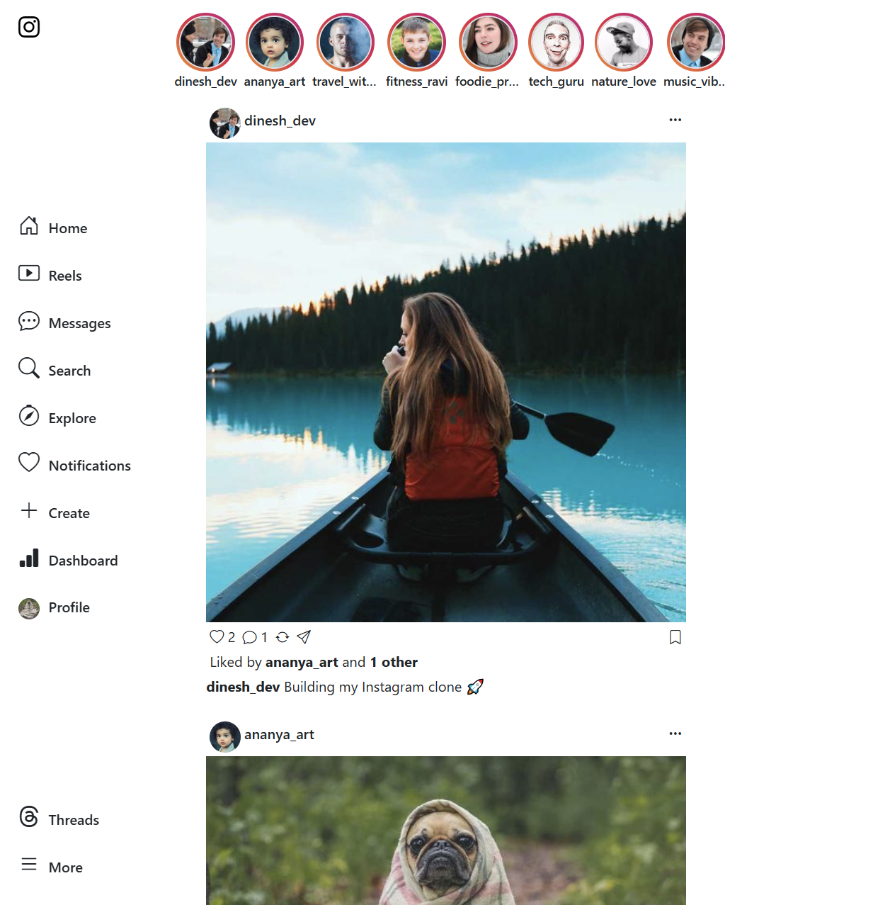
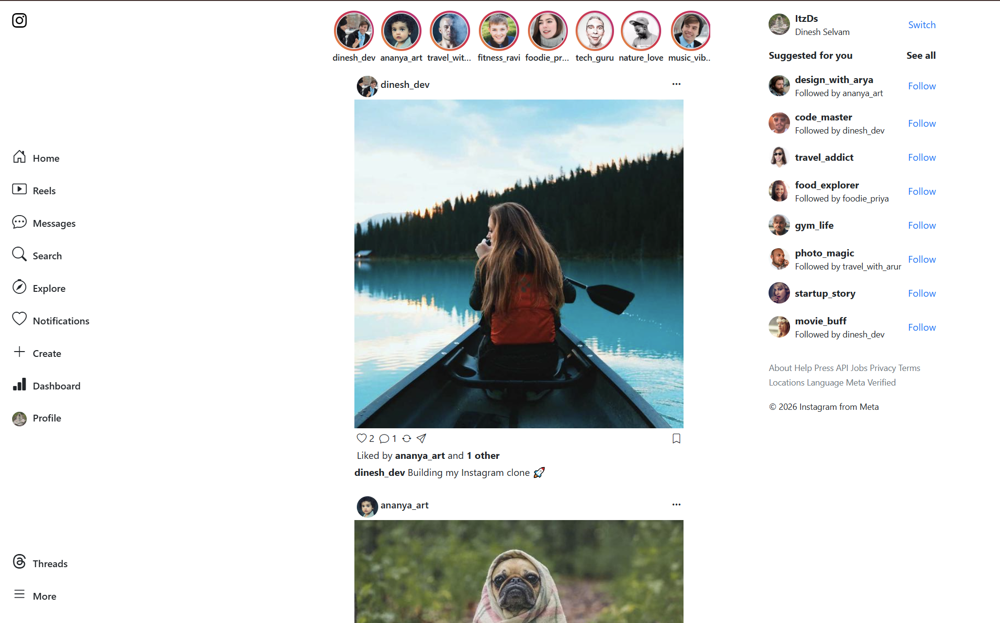
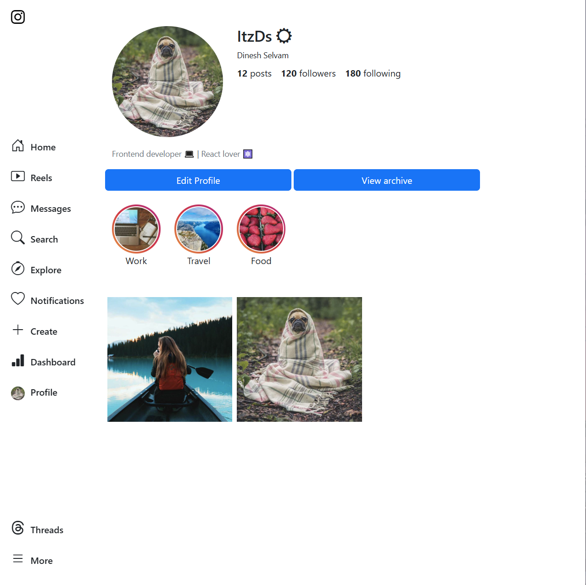
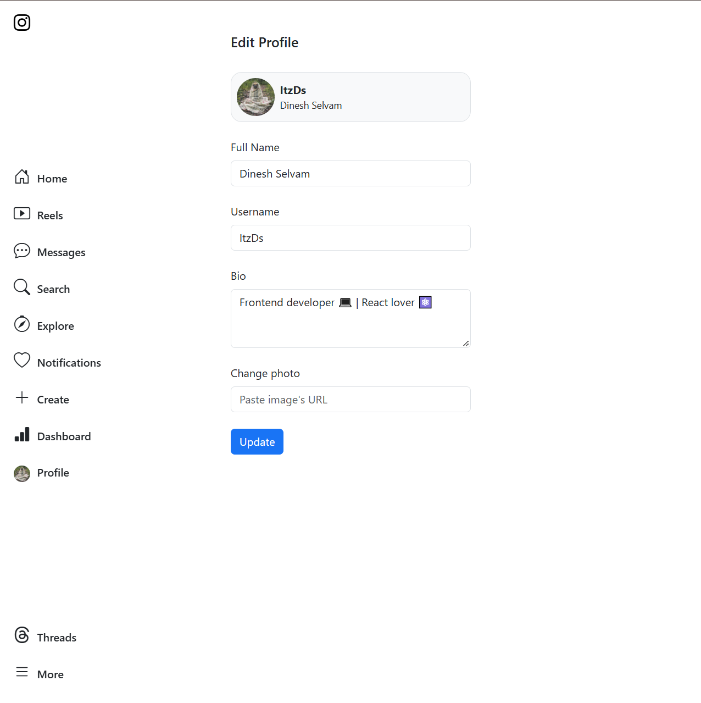

# InstaClone

A full-stack social media web application inspired by Instagram, built to practice modern web development concepts.

## Features

- User registration and login
- User profile
- Edit profile
- View posts
- View Status
- Responsive design

## Technologies Used

- React.js
- JavaScript
- HTML5
- CSS3
- Bootstrap
- JSON

## Project Structure

```text
InstaClone/
├── public/
├── src/
│   ├── assets/
│   ├── app.js
│   ├── home.js
│   ├── index.css
│   └── ...
├── package.json
└── README.md
```

## Installation

```bash
git clone https://github.com/itz-ds/instaClone.git
cd instaClone
npm install
```

## How to Run

```bash
npm start
npx json-server --watch database/db.json --port 3001 --static ./database
```

## Screenshots

### Home Page




### Status page


### Profile Page




## What I Learned

### Through this prokect, I practiced:

- Building reusable React componenets
- Managing state with React hooks
- Passing data using props
- Working with JSON data
- React routing
- Creating responsive layouts
- Oraganizing a React project
- Using Git and Github

### Future Improvements

- Implement real user authentication
- Handling user interactions
- Connect the application to a real backend
- Add a real database
- Add image upload functionality
- Add real-time notifications
- Add direct messaging
- Add light/dark theme for application

## Author

Dinesh Selvam
GitHub: https://github.com/itz-ds